# LoL_AI_Runes_Recommendation

Simple tool that recommends runes and summoner spells for League of Legends champions based on based on draft composition of both teams

## Introduction

League of Legends has many interacting factors during champion select: lane matchups, role synergies, team composition, and strategic choices. Simple methods like rule-based systems or win rate analysis are insufficient here. Rule-based approaches cannot capture the complex interactions between dozens of champions, five positions, and hundreds of rune combinations. Win rate analysis is problematic because match outcomes depend on player skill, teamwork, and macro decisions. Runes choice is only a small factor. This creates too much noise in the data, requiring an impractical amount of matches to extract meaningful signals.

Neural networks can learn these complex patterns from high-elo play. The AI models in this project are trained on Grandmaster+ Korean server matches to predict what keystones, lesser runes, shards and summoner spells high-elo players would pick given a specific draft. Players from the highest ranks probably understand runes and matchups better than average players. However, you still need game knowledge to understand why a recommendation makes sense and to apply it effectively in your games.

---

## Usage

**1. Download and open**

Clone or download the repository and open `index.html` in your browser.

**2. Load configuration files**

Click "Load Configuration Files"

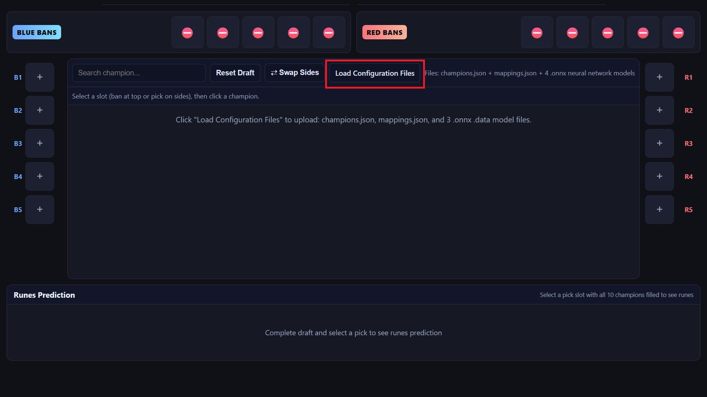

then go to the `config` directory, select all files and click "open".

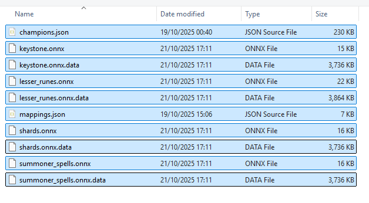

**3. Draft champions**

Click pick slots to select champions for both teams. Bans are optional and only prevent picking that champion in the UI — they don't affect predictions.

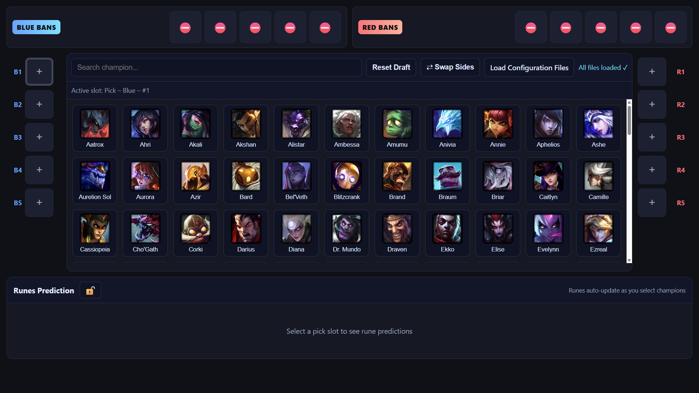

**4. View recommendations**

Select a pick slot to see rune and summoner spell recommendations. Predictions update automatically as you change the draft. Click the lock icon 🔒 to pin predictions to a specific slot. Even when you change other champions, recommendations for the locked champion remain visible.

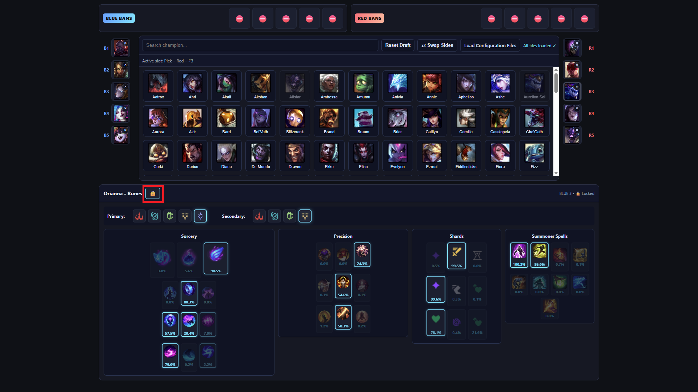

---

## How does it work?

Here are a few insights into how the models were created.

Training data: matche data was collected via the Riot Games API from Grandmaster/Challenger games on patch 25.20 on the Korean server. Data is preprocessed into tensors and used to train each model separately.

All models share the same input features:

- `champions_blue`: int[5] — blue team champion IDs in draft order (top, jg, mid, bot, sup)
- `champions_red`: int[5] — red team champion IDs in draft order
- `player_champion`: int — the player's champion ID
- `position`: int — 0=top, 1=jg, 2=mid, 3=bot, 4=sup
- `side`: int — 0=blue, 1=red

The project contains four separate models:

1. Keystones
   - Task: predict primary keystone rune (16 options)
   - Output: `keystone_probs [16]` (softmax, sum = 1.0)
   - Loss: categorical cross-entropy on the keystone class

2. Lesser Runes
   - Task: predict 5 lesser runes out of 45 options (15 slots × 3 per slot)
   - Model output handling:
     1. network produces `slots_logits [15]` and `lesser_runes_logits [45]`
     2. softmax slots and multiply by 5
     3. softmax per slot (each slot sums to 1.0), conditional probability
     4. P(lesser_rune) = P(lesser_rune | slot) * P(slot)
   - Ground truth: multi-hot [45] (exactly 5 ones)
   - Loss: multi-label cross-entropy (sum over selected entries)

3. Stat Shards
   - Task: predict 3 stat shards (offense, flex, defense) — each is a 1-of-3 choice
   - Output: logits `[3,3]`, softmax per row → probabilities, each row sums to 1.0
   - Loss: sum of three categorical cross-entropies (one per row)

4. Summoner Spells
   - Task: predict two summoner spells out of 9 competitive options
   - Output: probabilities `[9]` that represent marginal probabilities for selecting each spell. Softmax and multiplied by 2, to ensure the sum is 2.0. Model is trained to not give probability > 1.0, but it is not strictly enforced.
   - Loss: multi-label cross-entropy on the selected spells

---

## Examples

### Example 1: Matchup-Specific Runes

| Kassadin vs LeBlanc | Kassadin vs Fizz |
|---------------------|------------------|
|  | 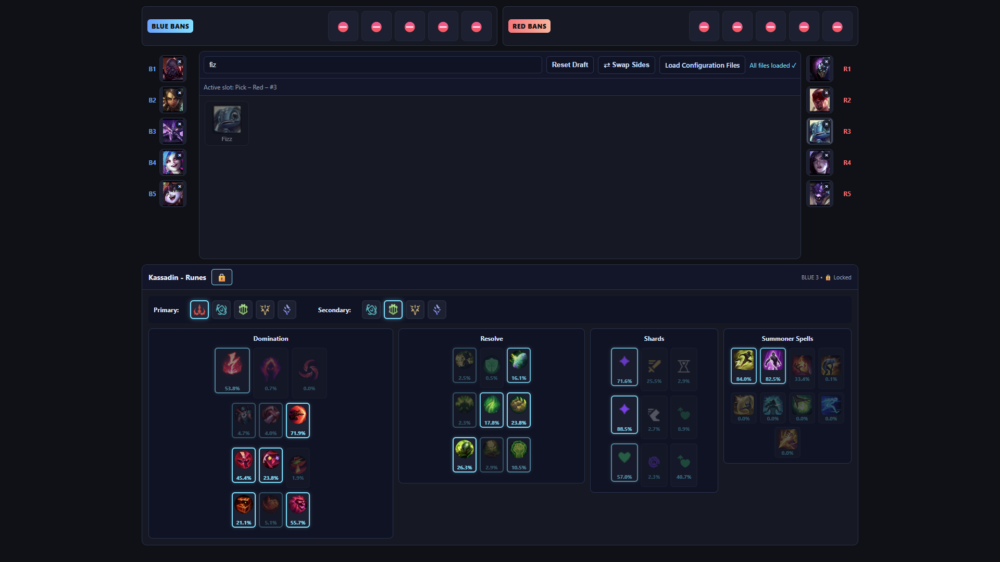 |
| **Second Wind** recommended. LeBlanc is ranged and can easily poke off Bone Plating from distance, making healing after trades more valuable. | **Bone Plating** recommended. Fizz is melee and must commit to all-in, making burst damage reduction more effective than sustained healing. |

### Example 2: Enemy Composition Influence

| Jinx vs champions without hard CC | Jinx vs TF/Lissandra/Leona |
|-----------------|----------------------------|
| 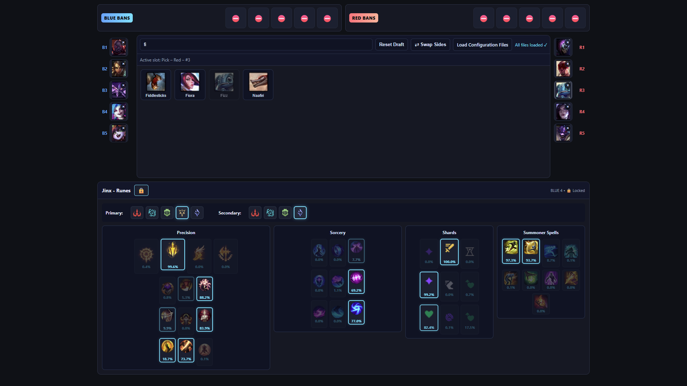 | 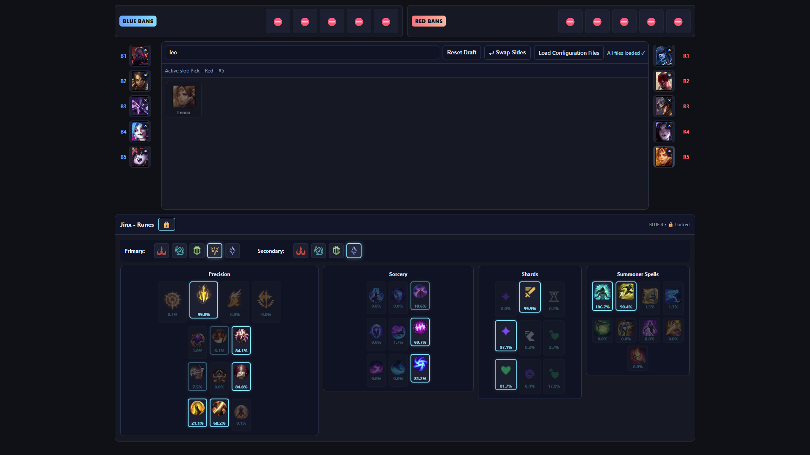 |
| Flash + Barrier (standard ADC setup) | **Cleanse probability increases to 106.7%**. This exceeds 100% because the model detects extreme value for Cleanse against heavy CC composition. This can be treated as either a bug or a feature highlighting critical importance. |

### Example 3: Keystone and Summoner Adaptation

| Garen vs Fizz (mid) | Garen vs Ryze (mid) |
|---------------------|---------------|
| 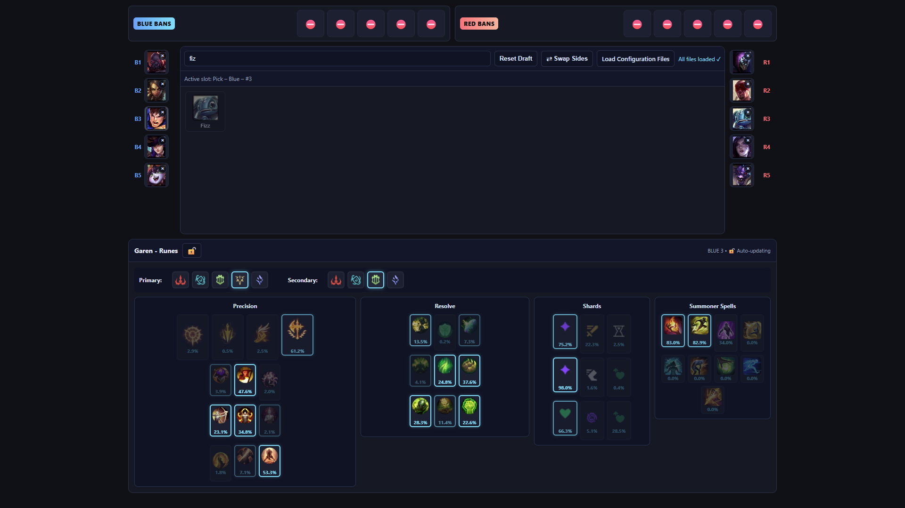 | 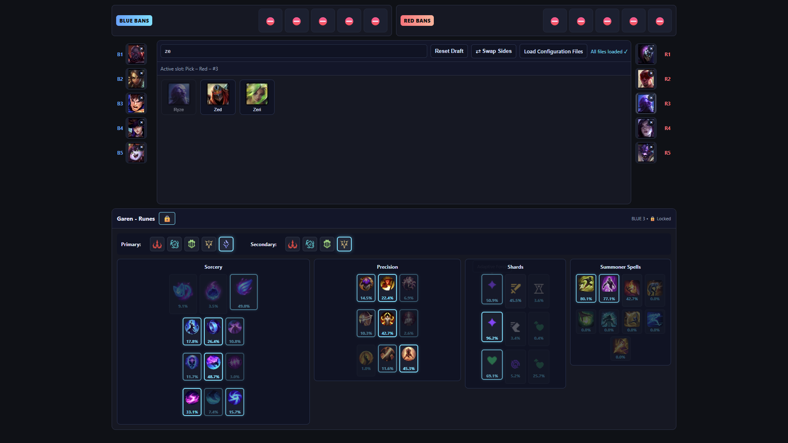 |
| **Conqueror + Ignite**. Garen can win melee-range all-ins against the assassin. | **Phase Rush + Teleport**. Phase Rush provides mobility to chase/escape from ranged poke. Teleport allows free recalls since Ryze controls wave and Garen must trade HP for last-hitting minions. |

### Example 4: Allied Synergy

| Nami + Lucian | Nami + Twitch |
|---------------|---------------|
| 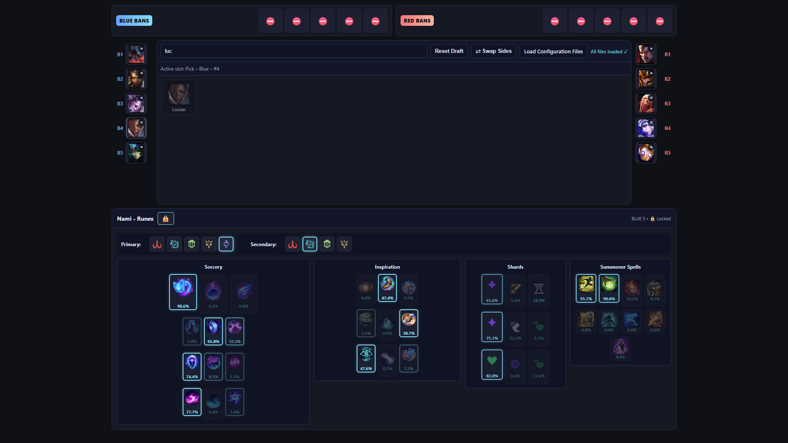 | 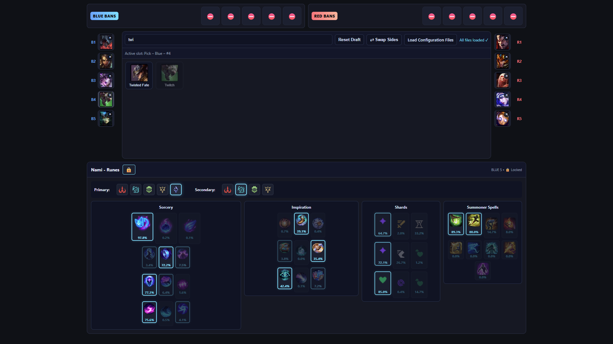 |
| **10.2% Ignite** probability. Lucian is aggressive early-game ADC, synergizes with Ignite for kill pressure. | **8.0% Ignite** probability. Twitch wants to play defensively and scale, reducing value of aggressive summoner. |

### Example 5: Side Influence

Nami + Lucian (Red side)

**Even higher Ignite probability** on red side. Red side bot lane is harder to gank and offers better tri-brush control which reduces the need for defensive summoner spells.

Remember that model outputs are statistical recommendations taken from patterns in the training dataset. They can reflect oddities in the data (e.g. unusually high probability for an off-meta keystone in rare configurations). Treat those as prompts to investigate, not absolute rules.

---

## Limitations

- Predictions are statistical patterns from training data, not absolute rules
- Unusual probabilities (like >100%) in rare drafts reflect strong statistical signals but may also indicate data quirks
- Bans are UI-only and don't modify model inputs
- AI was trained to predict only what Korean Grandmaster+ players would pick. It does not really understand what the perks of each rune are.

---

## Acknowledgements

- Language model Claude Sonnet 4.5 was used for assistance in coding.
- UI base and template adapted from the [draft-tool-lol-simple](https://github.com/Axword/draft-tool-lol-simple) project by [Axword](https://github.com/Axword)