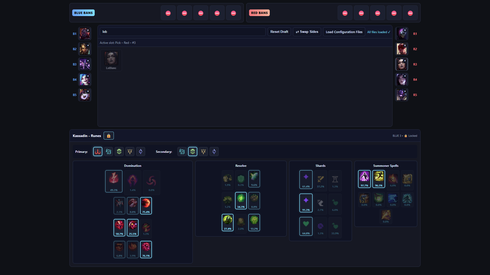
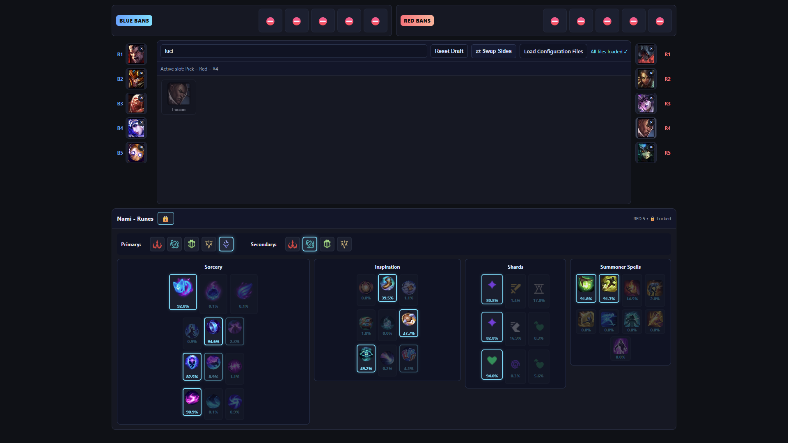

# LoL AI Runes Recommendation

**Available at: [lol-ai-runes.krzsztf.com](https://lol-ai-runes.krzsztf.com/)**

Simple tool that recommends runes and summoner spells for League of Legends champions based on based on draft composition of both teams. Created on patch 25.20 (Worlds 2025 patch).

## Introduction

League of Legends has many interacting factors which should be considered to prepare loadout before match: lane matchups, role synergies, team composition. There are many websites which may recommend you runes for a specific champion. These websites use simple methods like pick rate or win rate of a specific champion on a given role. This approach fails to capture the complex interactions between other champions, two sides, five unique positions on each side, 1.6 · 10²² possible champion drafts (where order matters) and 1.3 · 10⁸ possible loadout combinations (including keystones, lesser runes, and summoner spells).

Approach of this project is to utilize neural networks to learn these complex patterns from high-elo play. The AI models in this project are trained on Grandmaster+ Korean server matches to predict what keystones, lesser runes, shards and summoner spells high-elo players would pick given a specific draft. Win rate analysis is problematic because match outcomes depend on players in-game skill. Runes choice is only a small factor. This creates too much noise in the data, requiring an large amount of matches to extract meaningful signals and there aren't enough matches played on Grandmaster+ KR. Therefore, the goal of this project is to imitate high-elo players rather than to make the AI understand runes on its own and suggest them based on their statistics.

Players from the highest ranks probably understand runes and matchups better than average players. However, you still need game knowledge to understand why a recommendation makes sense and to apply it effectively in your games.

---

## Usage

You can use GitHub pages version: visit [lol-ai-runes.krzsztf.com](https://lol-ai-runes.krzsztf.com/) and skip **step 1.** and **step 2.**

**Step 1. Download and open**

Clone or download the repository. Open `index.html` in your browser. 

Alternatively, you can host it yourself with the command `python -m http.server 8000 --bind 127.0.0.1`, then go to [http://127.0.0.1:8000/](http://127.0.0.1:8000/) and skip **step 2.**

**Step 2. Load configuration files**

Due to browser CORS (Cross-Origin Resource Sharing) security policies, if you open index.html directly from your file system, you have to load the configuration manually.

Click **"Load Configuration Files"**

then navigate to the `config` directory, select all files and click **"open"**.

**Step 3. Draft champions**

Click pick slots to select champions for both teams. Bans are optional and only prevent picking that champion in the UI — they don't affect recommendations.

**Step 4. View recommendations**

Select a pick slot to see runes and summoner spells recommendations. Predictions update automatically as you change the draft. Click the lock icon 🔒 to pin predictions to a specific slot. Even when you pick other slot, recommendations for the locked🔒 champion remain visible.

---

## How does it work?

Here are a few insights into how the models were created.

Training data: matche data was collected via the Riot Games API from Grandmaster/Challenger games on patch 25.20 on the Korean server. Data is preprocessed into tensors and used to train each model separately.

All models share the same input features:

- `champions_blue`: int[5] — blue team champion IDs in order (top, jg, mid, bot, sup)
- `champions_red`: int[5] — red team champion IDs in order
- `player_champion`: int — the player's champion ID
- `position`: int — 0=top, 1=jg, 2=mid, 3=bot, 4=sup
- `side`: int — 0=blue, 1=red

The project contains four separate models:

1. Keystones
   - Task: predict primary keystone rune (16 options)
   - Output: `keystone_probs [16]` (softmax, sum = 1.0)
   - Loss: categorical cross-entropy on the keystone class

2. Lesser Runes
   - Task: predict 5 lesser runes out of 45 options (15 slots × 3 per slot)
   - Model output handling:
     1. network produces `slots_logits [15]` and `lesser_runes_logits [45]`
     2. softmax slots and multiply by 5
     3. softmax per slot (each slot sums to 1.0), conditional probability
     4. P(lesser_rune) = P(lesser_rune | slot) * P(slot)
   - Ground truth: multi-hot [45] (exactly 5 ones)
   - Loss: multi-label cross-entropy (sum over selected entries)

3. Stat Shards
   - Task: predict 3 stat shards (offense, flex, defense) — each is a 1-of-3 choice
   - Output: logits `[3,3]`, softmax per row → probabilities, each row sums to 1.0
   - Loss: sum of three categorical cross-entropies (one per row)

4. Summoner Spells
   - Task: predict two summoner spells out of 9 competitive options
   - Output: probabilities `[9]` that represent marginal probabilities for selecting each spell. Softmax and multiplied by 2, to ensure the sum is 2.0. Model is trained to not give probability > 1.0, but it is not strictly enforced.
   - Loss: multi-label cross-entropy on the selected spells

---

## Examples

### Example 1: Matchup-Specific Runes

| Kassadin vs LeBlanc | Kassadin vs Fizz |
|---------------------|------------------|
|  |  |
| **Second Wind** recommended. LeBlanc is ranged and can easily poke off Bone Plating from distance, making healing after trades more valuable. | **Bone Plating** recommended. Fizz is melee and must commit to all-in, making burst damage reduction more effective than healing after trades. |

### Example 2: Enemy Composition Influence

| Jinx vs champions without hard CC | Jinx vs TF/Lissandra/Leona |
|-----------------|----------------------------|
|  |  |
| Flash + Barrier (standard ADC setup) | **Cleanse probability increases to 106.7%**. This exceeds 100% because the model detects extreme value for Cleanse against heavy CC composition. This can be treated as either a bug or a feature highlighting critical importance. |

### Example 3: Off-meta champion recommendation

| Garen vs Fizz (mid) | Garen vs Ryze (mid) |
|---------------------|---------------|
|  |  |
| **Conqueror + Ignite**. Fizz is melee-range assassin. This setup makes Garen will all-in. | **Phase Rush + Teleport**. Phase Rush provides mobility to chase ranged poke. Teleport allows free recalls since Ryze controls wave and Garen must trade HP for last-hitting minions. |

### Example 4: Allied Synergy

| Nami + Lucian | Nami + Twitch |
|---------------|---------------|
|  |  |
| **10.2% Ignite** probability. Lucian is aggressive early-game ADC, synergizes with Ignite on support for kill pressure. | **8.0% Ignite** probability. Twitch wants to play defensively and scale, increasing value of defensive summoners. |

### Example 5: Side Influence

Nami + Lucian (Red side)

**14.6% Ignite** probability on red side. Red side bot lane is harder to gank and offers better tri-brush control which reduces the need for defensive summoner spells.

---

## Limitations

- Recommendations are statistical patterns from training data, not absolute rules
- Unusual probabilities (like >100%) in rare drafts reflect strong statistical signals but may also indicate data quirks
- AI was trained to predict only what Korean Grandmaster+ players would pick. It does not really understand what the perks of each rune are.

---

## Acknowledgements

- Language model Claude Sonnet 4.5 was used for assistance in coding.
- UI base and template adapted from the [draft-tool-lol-simple](https://github.com/Axword/draft-tool-lol-simple) project by [Axword](https://github.com/Axword)